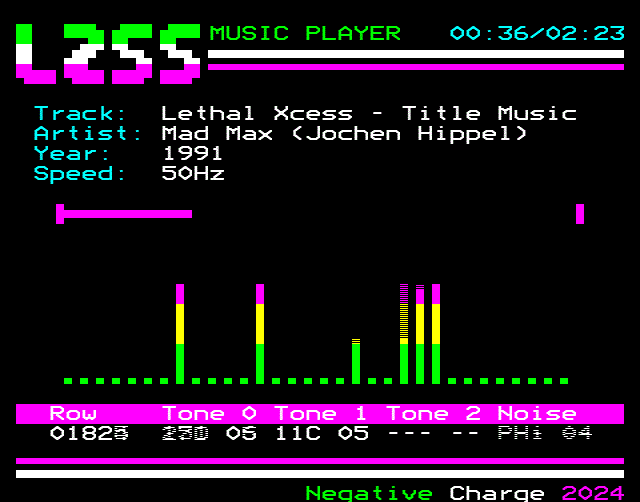

# BBC Micro SN76489 LZSS Compressed Music Player

This app plays back an LZSS compressed stream of sequential SN76489 register writes which is essentially the register data stored as 11 bytes x N frames.

This is based on the Atari SAP LZSS Player/Compressor by DMSC : https://github.com/dmsc/lzss-sap

There are three players in the lib folder.  The first supports 9 streams and expects the input into the compressor to be in the format:

`[Tone 0 Latch/Data][Tone 0 Data][Tone 1 Latch/Data][Tone 1 Data][Tone 2 Latch/Data][Tone 2 Data][Noise Latch/Data][Vol 0|Vol 1][Vol 2|Vol 3]`

..using the format for Latch/Data bytes described here: https://www.smspower.org/Development/SN76489 
However, the attenuation / volume is compressed into two bytes of two nybbles containing a value between 0 and 15

The second player uses 7 compressed streams in the format:

`[Vol 0|Tone 0 (bottom 4 bits)][Tone 0 (top 6 bits)][Vol 1|Tone 1 (bottom 4 bits)][Tone 1 (top 6 bits)][Vol 2|Tone 2 (bottom 4 bits)][Tone 2 (top 6 bits)][Vol 3|Noise (bottom 4 bits)]`

The third player is the same as the second, but includes a header in the format:

`[Speed in hz : 16-bit/2 bytes][IRQ Rate : (1000000/hz)-2 : 16-bit/2 bytes][Track length : Seconds (Hex), Minutes (Hex) : 2 bytes][Track title - null terminated][Track artist - null terminated][Track year - null terminated]

This format is known as LZC1 (.lzc)

## Lempel–Ziv–Storer–Szymanski

Lempel–Ziv–Storer–Szymanski (LZSS) is a lossless data compression algorithm, a derivative of LZ77, that was created in 1982 by James A. Storer and Thomas Szymanski.

LZSS is a dictionary coding technique. It attempts to replace a string of symbols with a reference to a dictionary location of the same string.

The main difference between LZ77 and LZSS is that in LZ77 the dictionary reference could actually be longer than the string it was replacing. In LZSS, such references are omitted if the length is less than the "break even" point. Furthermore, LZSS uses one-bit flags to indicate whether the next chunk of data is a literal (byte) or a reference to an offset/length pair.
